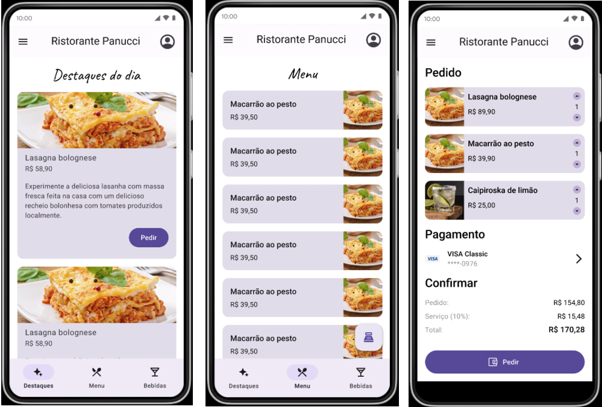

# Panucci Ristorante - A Flutter project covering responsive layouts and constraints



For help getting started with Flutter development, view the
[online documentation](https://docs.flutter.dev/), which offers tutorials,
samples, guidance on mobile development, and a full API reference.


## Main concepts covered in this project

● Limit widget sizes with constraints and understand their importance

● Build appropriate layouts with correct sizes using Constraints

● Implement four screens in a practical food delivery project

● Implement different types of product lists

● Create a responsive app that works in portrait and landscape orientations

● Capture device size and orientation with Media.Query

● Understand and use CustomScrollView and Slivers widgets, and classes like Media.Query

---
## Common viewport error
<span style="color: red;">════════ Exception caught by rendering library ═════════════════════════════════</span>
The following assertion was thrown during performResize():  
<span style="color: red;">Vertical viewport was given unbounded height.</span>  
Viewports expand in the scrolling direction to fill their container. In this case, a vertical viewport was given an unlimited amount of vertical space in which to expand. This situation typically happens when a scrollable widget is nested inside another scrollable widget.

### How to reproduce it?
We got this error after trying to put a title (Text widget) in the Highligths screen. While the page had only the ListView as a child everything worked fine, because the list assumed the whole size of the screen. However, after putting the ListView and a Text inside a Column, the ListView lost the size constraint, causing the error.

### How to fix it?
We can wrap the ListView with a SizedBox, and then specify the property height of the box.  
But how to know what value of height we need? One possible solution is to use a CustomScrollView with sliver widgets: 
```dart
  child: CustomScrollView(
        slivers: <Widget>[
          const SliverToBoxAdapter(child: Text('Destaques do dia')),
          SliverList(
            delegate: SliverChildBuilderDelegate(
              (context, index) {
                return HighlightItem(
                    imageURI: items[index]['image'],
                    itemTitle: items[index]['name'],
                    itemPrice: items[index]['price'],
                    itemDescription: items[index]['description']);
              },
              childCount: items.length,
            ),
          )
        ],
      ),
